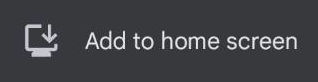

<!-- _class: title -->

# PWA:<br>web pages the browser can install

Daniel Ecer &nbsp;·&nbsp; 19 May 2026

---

# You may have seen this before.

<div class="flow" style="margin: 1.5em 0; justify-content: flex-start;">
  
  <div class="flow-arrow">→</div>
  
</div>

The browser handles distribution. No app store account, no review process.

<!-- Chrome, Edge, and mobile browsers show the prompt when a site provides a web manifest with a name and start_url. The user clicks once, and the site gets a home screen icon and its own window. -->

---

# Why home screen presence matters.

[Rakuten 24](https://web.dev/case-studies/rakuten-24) tracked users who installed their PWA against those who did not, over one month:

- **310%** more visit frequency
- **450%** higher retention rate

Users no longer need to recall a URL. The icon on the home screen is enough to bring them back.

<!-- Source: [Rakuten 24 case study](https://web.dev/case-studies/rakuten-24) — e-commerce context, so the absolute numbers won't transfer directly, but the direction is consistent across published case studies. -->

---

# One file triggers the install prompt.

**`site.webmanifest`**

```json
{
  "name": "Sciety Labs",
  "short_name": "Sciety Labs",
  "start_url": "/",
  "display": "standalone"
}
```

`display: standalone` removes the browser address bar. The app opens in its own window.

<!-- No service worker required for this step. -->

---

# What you get.

- Install prompt in Chrome, Edge, and mobile browsers
- Standalone window: no address bar, no browser tabs
- Theme colour in the OS title bar and Android task switcher
- App icon on the home screen or taskbar

<!-- Works with an existing site, no changes to routing or templates beyond the manifest. -->

<!-- demo: show the installed Sciety Labs window, or show a screenshot side by side with the browser version -->

---

# Offline support: a separate step.

The user sees your page instead of a browser error.

| Resource | Strategy | Behaviour |
|---|---|---|
| Static assets | Stale-while-revalidate | Serve from cache, update in background |
| Navigation | Network-first | Try network, fall back to `/offline` |

<!-- In Sciety Labs: sw.js handles static asset caching and a /offline fallback. The offline.html is eight lines. The two FastAPI routes are eight lines. -->

---

# What else the platform offers.

**Push notifications**: notify users when new content appears, without an app store or native build.

**Badging API**: show an unread count on the installed app icon, the way a native app would.

<!-- Each of these is a separate API with its own browser support profile. Push notifications have broad support; the Badging API is primarily Chrome and Edge on desktop and Android. -->

---

# Going further.

**Custom install prompt**: the browser's passive mini-infobar has a [low acceptance rate](https://github.com/WebKit/standards-positions/issues/619). Handling the `beforeinstallprompt` event lets you show a prompt at the right moment.

**iOS**: Safari does not fire `beforeinstallprompt`. A separate instruction banner is needed: "tap Share, then Add to Home Screen."

**Richer manifest**: adding `description` and `screenshots` upgrades the Chrome Android dialog from a mini-infobar to a fuller install sheet.

**App stores**: the same manifest enables Google Play and Microsoft Store distribution via [PWABuilder](https://www.pwabuilder.com/). Apple App Store carries [policy risk](https://developer.apple.com/app-store/review/guidelines/#minimum-functionality) for content platforms.

<!-- Sources: [Patterns for promoting PWA installation](https://web.dev/articles/promote-install), [WebKit standards-positions issue 619](https://github.com/WebKit/standards-positions/issues/619) ("browser-initiated UI has very low engagement" — WebKit's own data). -->

---

# Where this might be worth adding.

**elifesciences.org**: readers who return regularly to read articles.

**sciety.org**: users checking the latest papers reviewed by a group.

---

<!-- _class: dark -->

# The manifest is the starting point.

- Add `site.webmanifest` with a name and `start_url`
- The browser shows the install prompt
- Add a service worker when you want offline support
